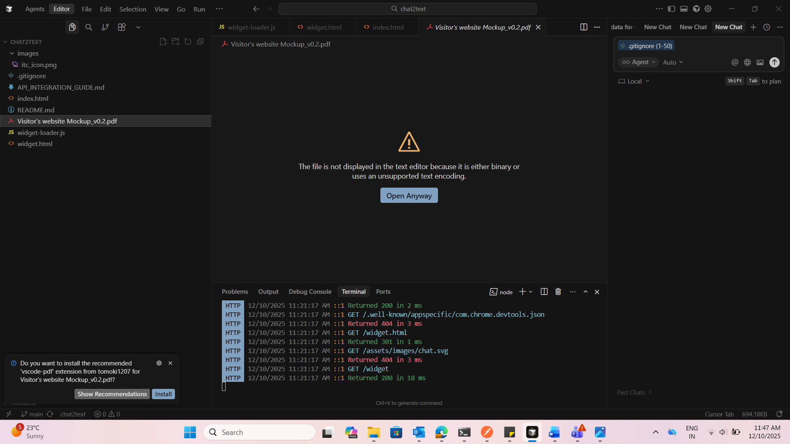
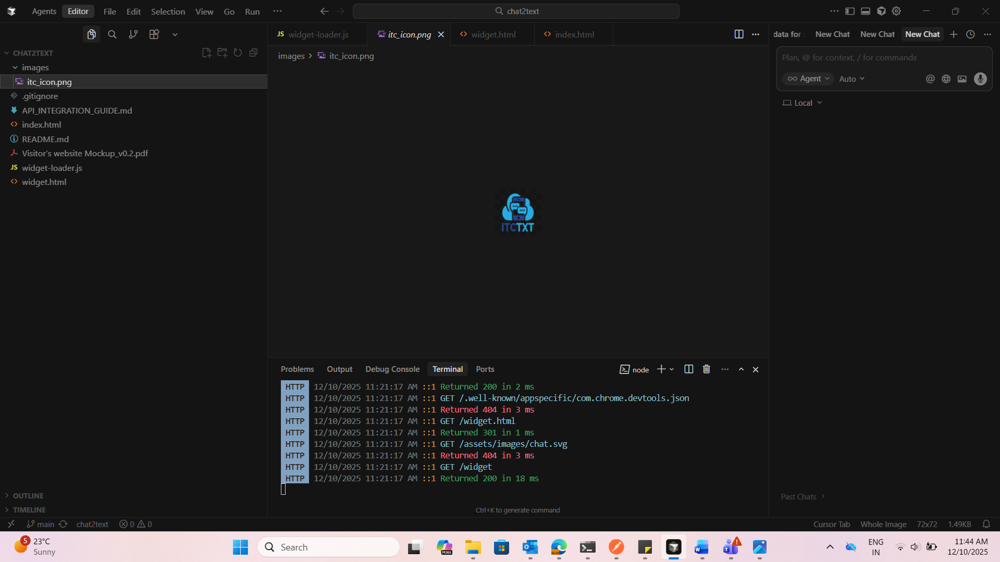

# Secure Embeddable Chat Widget

A web-based chat widget designed to be embedded into partner websites
to enable communication between website visitors and businesses.

## Overview

This project implements an embeddable chat widget that can be integrated
into a partner website using a JavaScript loader.

The widget provides a separate chat interface while communicating with
backend APIs for widget configuration, session management and messaging.

## Features

- Embeddable JavaScript widget
- iframe-based UI isolation
- Cross-origin communication
- Widget configuration through APIs
- Department selection
- Address selection
- Dynamic form handling
- Chat session creation
- Message submission
- Loading and error handling

## Architecture

```text
Partner Website
       |
       v
JavaScript Loader
       |
       v
widget-loader.js
       |
       | Creates iframe
       v
   widget.html
       |
       | API Requests
       v
   Backend APIs
       |
       +----------------+
       |                |
       v                v
Widget Configuration   Chat Session
                            |
                            v
                        Messaging


**Important:** There are three backticks before `text` and three after the diagram.

---

## Step 7 — Add the API flow

Paste:

```markdown
## API Flow

The widget communicates with the backend through multiple stages:

1. Fetch widget configuration
2. Perform handshake
3. Create a chat session
4. Exchange messages

Additional application data can be retrieved through APIs for:

- Departments
- Addresses
- Form fields
- Form submission

## Embedding the Widget

The widget can be integrated into a partner website using a JavaScript
script tag.

Example:

```html
<script
    src="widget-loader.js"
    async
    data-widget-id="YOUR_WIDGET_ID"
    data-position="bottom-left">
</script>


Your original demo uses this same general integration approach with a script tag and widget ID. :contentReference[oaicite:2]{index=2}

---

## Step 9 — Add Security

Paste:

```markdown
## Security Considerations

Security is an important part of an embeddable widget because it can
operate across different website origins.

The project considers:

- iframe isolation
- Origin validation
- Secure authentication
- Short-lived authentication tokens
- Content Security Policy
- Server-side authorization
- API rate limiting
- Secure cookie configuration

Production credentials and private API information are not included
in this repository.

## Project Structure

```text
secure-chat-widget/
│
├── README.md
├── LICENSE
├── .gitignore
│
├── docs/
│   └── API_INTEGRATION_GUIDE.md
│
└── screenshots/
    ├── widget-development.png
    └── widget-project.png


---

## Step 11 — Add technologies

Paste:

```markdown
## Technologies

- HTML
- CSS
- JavaScript
- REST APIs
- iframe
- Git

## Documentation

Detailed API integration information is available in:

`docs/API_INTEGRATION_GUIDE.md`

The documentation covers:

- API configuration
- Department API
- Address API
- Form fields API
- Form submission API
- Error handling
- Loading states

## Screenshots

### Widget Development



### Project Development



## Future Improvements

- Complete backend integration
- Dynamic form configuration
- Automated testing
- Improved error handling
- Better API configuration management
- CI/CD integration
- Containerized deployment
- Additional security hardening

## Author

**Darahaas Vadlamudi**
